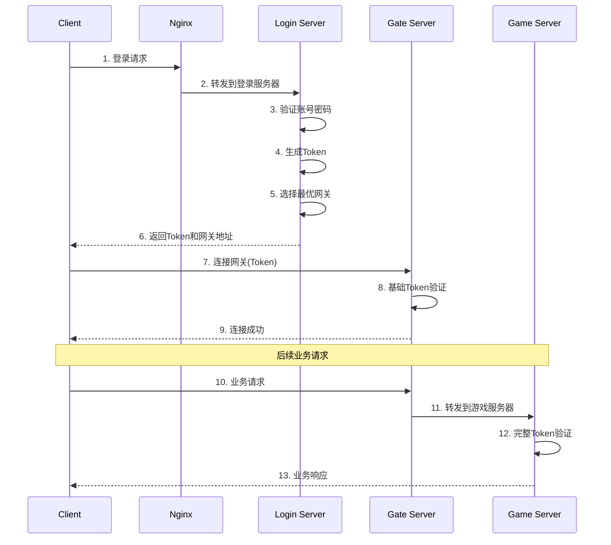
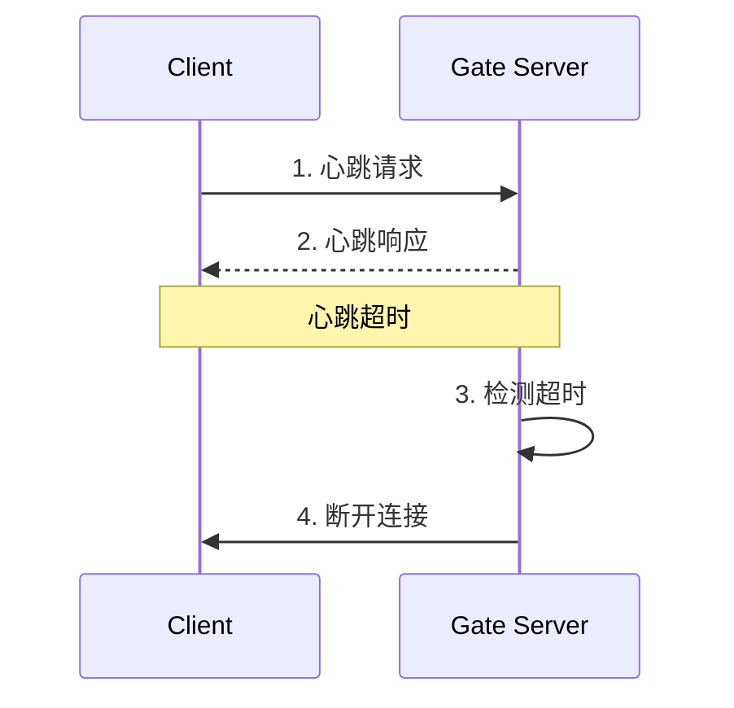
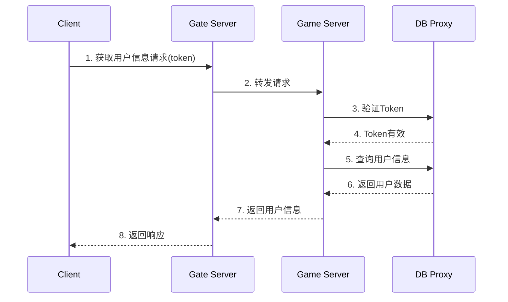

# 流程说明

## 1. 登录流程

**流程说明:**
1. 客户端发送登录请求到Nginx
2. Nginx根据配置转发到登录服务器
3. 登录服务器验证账号密码
4. 验证成功后生成JWT Token
5. 根据负载均衡策略选择合适的网关
6. 返回Token和网关信息给客户端
7. 客户端使用Token连接网关
8. 网关进行基础Token验证(格式、过期时间)
9. 验证通过后建立WebSocket连接
10. 客户端发送业务请求
11. 网关转发请求到游戏服务器
12. 游戏服务器进行完整Token验证(包括权限、状态等)
13. 返回业务响应

## 2. 心跳机制

**流程说明:**
1. 客户端定期发送心跳请求
2. 网关返回心跳响应
3. 网关检测心跳超时
4. 超时后断开连接

## 3. 获取用户信息流程

**流程说明:**
1. 客户端发送获取用户信息请求
2. 网关转发请求到游戏服务器
3. 游戏服务器通过DB代理验证Token
4. Token验证通过
5. 游戏服务器查询用户数据
6. DB代理返回用户信息
7. 游戏服务器处理并返回数据
8. 网关将响应发送给客户端
