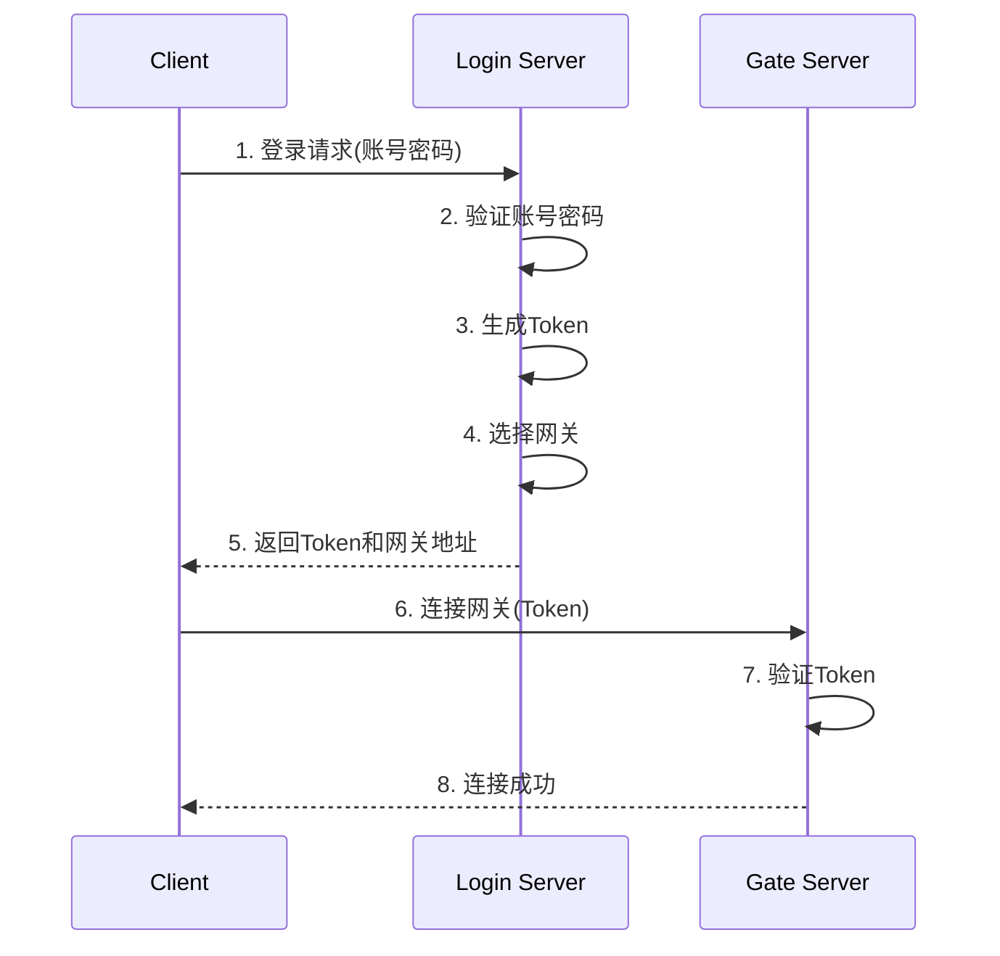
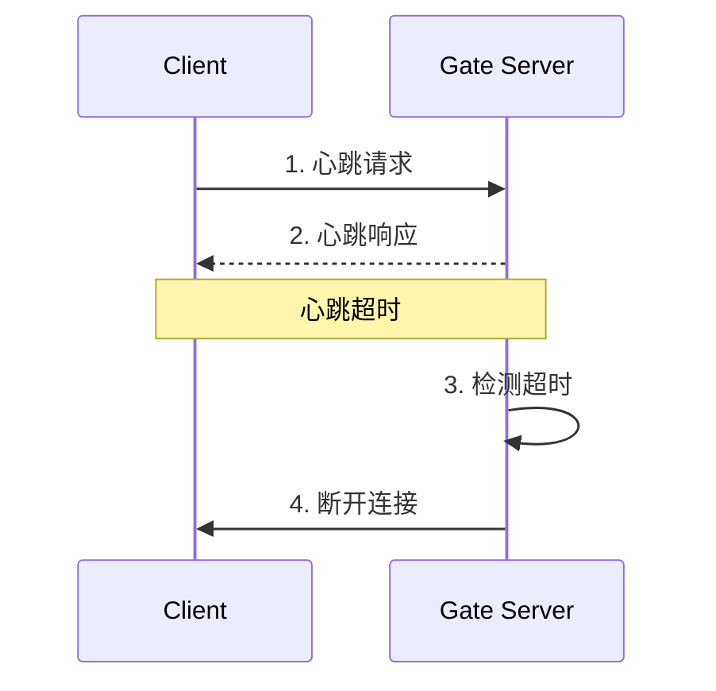
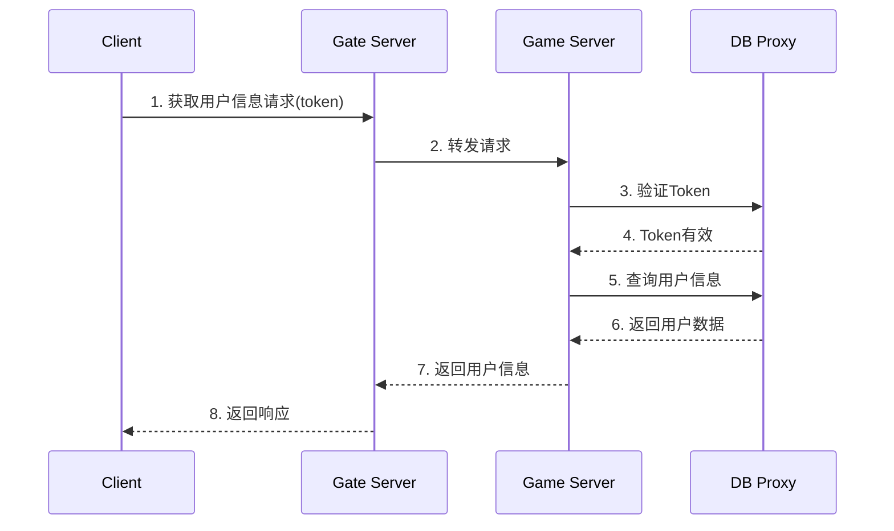

# 协议说明

## 协议格式

### 1. 基础消息格式
```protobuf
message BaseRequest {
    Session session = 1;    // 会话信息
    bytes payload = 2;      // 消息内容
}

message BaseResponse {
    Session session = 1;    // 会话信息
    int32 errorCode = 2;    // 错误码
    string errorMsg = 3;    // 错误信息
    bytes payload = 4;      // 消息负载
}

message Session {
    int32 messageId = 1;    // 消息ID
    int32 sequence = 2;     // 序列号
    int64 timestamp = 3;    // 时间戳
    string version = 4;     // 版本号
}
```

## 业务协议

### 1. 登录流程

#### 登录请求
```protobuf
message C2LLoginRequest {
    string account = 1;      // 账号
    string password = 2;     // 密码
    string device_id = 3;    // 设备ID
    string platform = 4;     // 平台标识
    string version = 5;      // 客户端版本
}
```

#### 登录响应
```protobuf
message S2LLoginResponse {
    int32 code = 1;         // 错误码
    string message = 2;     // 错误信息
    string token = 3;       // JWT令牌
    string ws_addr = 4;     // WebSocket地址
    int32 ws_port = 5;      // WebSocket端口
}
```

### 2. 心跳机制

#### 心跳请求
```protobuf
message C2GHeartbeat {
    int64 timestamp = 1;    // 时间戳
    int32 clientId = 2;     // 客户端ID
}
```

#### 心跳响应
```protobuf
message G2CHeartbeat {
    int64 timestamp = 1;    // 服务器时间戳
    int32 code = 2;        // 状态码
}
```

### 3. 用户信息

#### 获取用户信息请求
```protobuf
message C2GUserInfoRequest {
    string token = 1;       // JWT令牌
    string name = 2;        // 角色名（可选）
    int32 gender = 3;       // 性别（可选）
    int32 job = 4;          // 职业（可选）
}
```

#### 获取用户信息响应
```protobuf
message G2CUserInfoResponse {
    int32 code = 1;        // 错误码
    string message = 2;    // 错误信息
    UserInfo user = 3;     // 用户信息
    bool is_new = 4;       // 是否是新创建的用户
}
```

## 错误码定义

```protobuf
enum ErrorCode {
    ERROR_CODE_SUCCESS = 0;              // 成功
    ERROR_CODE_SYSTEM_ERROR = 1;         // 系统错误
    ERROR_CODE_INVALID_PARAMS = 2;       // 无效参数
    ERROR_CODE_INVALID_ACCOUNT = 3;      // 无效账号
    ERROR_CODE_INVALID_PASSWORD = 4;     // 密码错误
    ERROR_CODE_ACCOUNT_EXISTS = 5;       // 账号已存在
    ERROR_CODE_ACCOUNT_NOT_FOUND = 6;    // 账号不存在
    ERROR_CODE_TOKEN_INVALID = 7;        // 无效的令牌
    ERROR_CODE_TOKEN_EXPIRED = 8;        // 令牌已过期
    ERROR_CODE_SERVER_BUSY = 9;          // 服务器繁忙
    ERROR_CODE_VERSION_NOT_MATCH = 10;   // 版本不匹配
    ERROR_CODE_GATE_NOT_AVAILABLE = 11;  // 网关不可用
}
```

## 协议规范

### 1. 命名规范
- 请求消息: C2X_功能名_Request
- 响应消息: X2C_功能名_Response
- 枚举类型: 大写下划线
- 字段名称: 小写下划线

### 2. 版本控制
- 每个消息都包含版本号
- 向下兼容原则
- 不删除已有字段
- 新增字段使用optional

### 3. 安全规范
- 敏感数据加密传输
- Token认证
- 防重放攻击
- 数据校验

## 协议流程

### 登录流程


### 心跳机制


### 获取用户信息流程
