# 流程说明

## 1. 登录流程

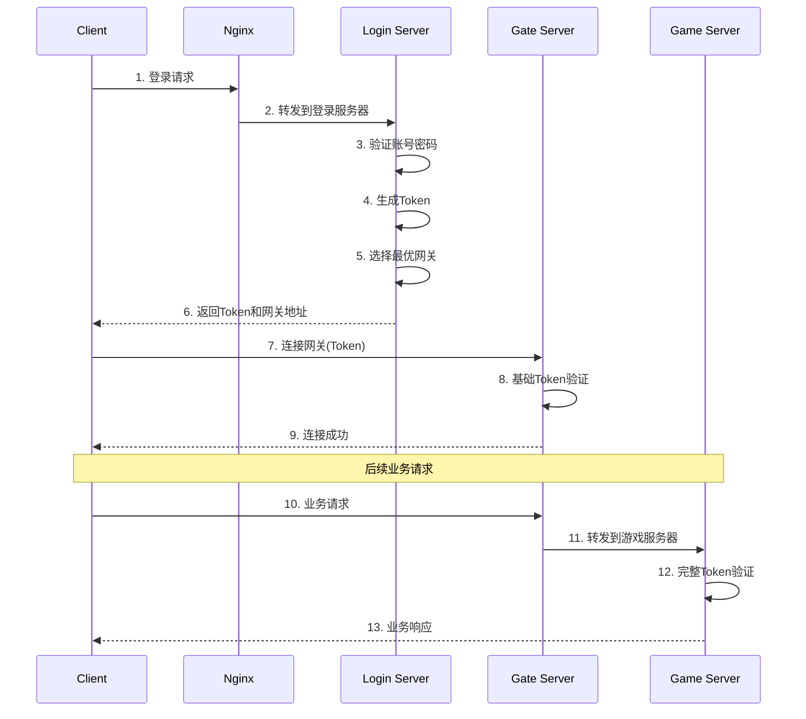

**流程说明:**
1. 客户端发送登录请求到Nginx
2. Nginx根据配置转发到登录服务器
3. 登录服务器验证账号密码
4. 验证成功后生成JWT Token
5. 根据负载均衡策略选择合适的网关
6. 返回Token和网关信息给客户端
7. 客户端使用Token连接网关
8. 网关进行基础Token验证(格式、过期时间)
9. 验证通过后建立WebSocket连接
10. 客户端发送业务请求
11. 网关转发请求到游戏服务器
12. 游戏服务器进行完整Token验证(包括权限、状态等)
13. 返回业务响应

## 2. 心跳机制

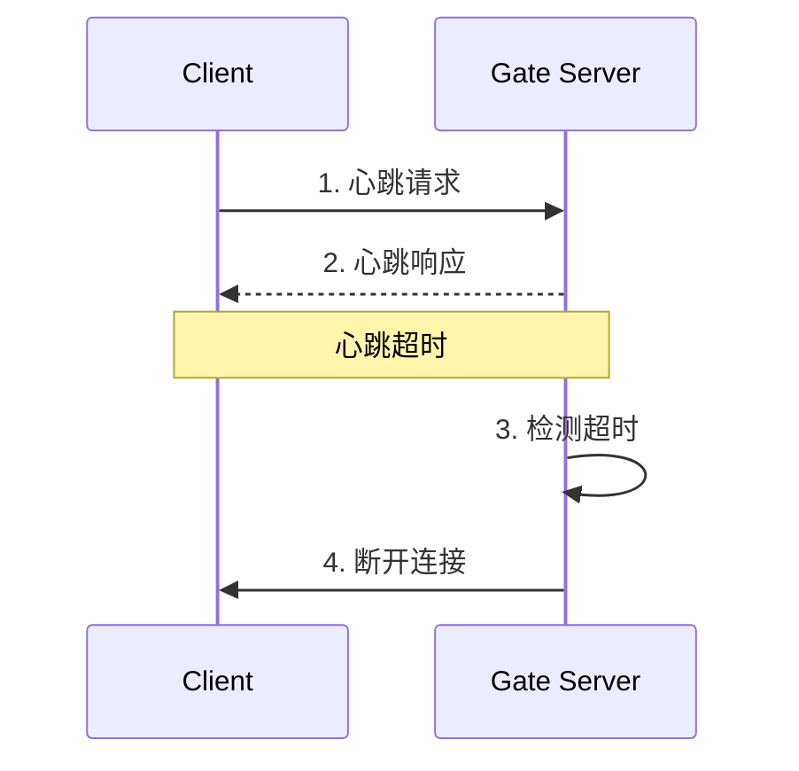

**流程说明:**
1. 客户端定期发送心跳请求
2. 网关返回心跳响应
3. 网关检测心跳超时
4. 超时后断开连接

## 3. 获取用户信息流程

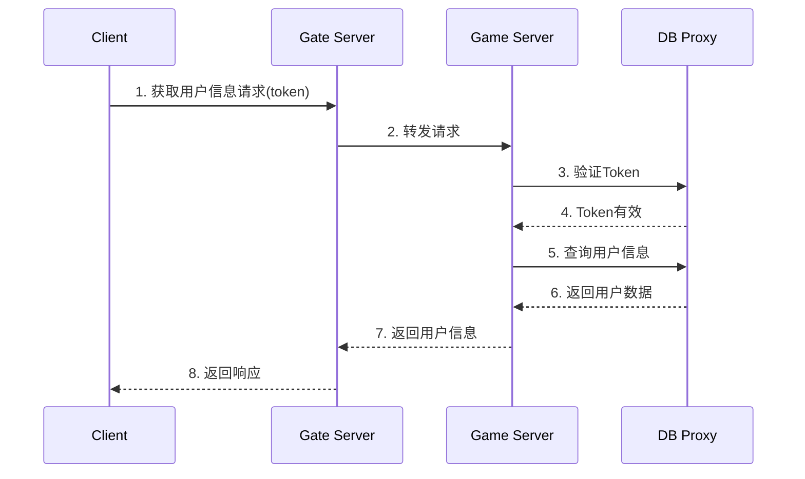

**流程说明:**
1. 客户端发送获取用户信息请求
2. 网关转发请求到游戏服务器
3. 游戏服务器通过DB代理验证Token
4. Token验证通过
5. 游戏服务器查询用户数据
6. DB代理返回用户信息
7. 游戏服务器处理并返回数据
8. 网关将响应发送给客户端

## 4. 获取用户卡牌流程

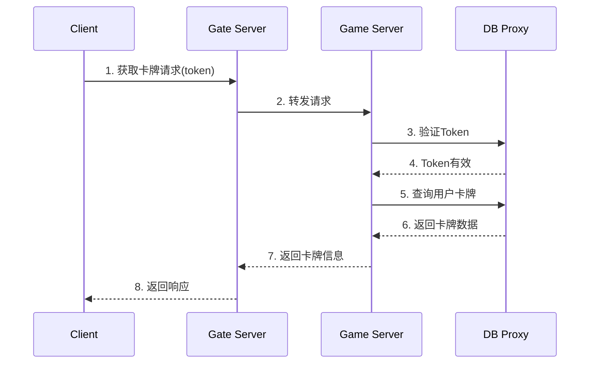

**流程说明:**
1. 客户端发送获取卡牌请求
2. 网关转发请求到游戏服务器
3. 游戏服务器通过DB代理验证Token
4. Token验证通过
5. 游戏服务器查询用户卡牌数据
6. DB代理返回卡牌信息
7. 游戏服务器处理并返回数据
8. 网关将响应发送给客户端

## 5. 物品系统流程

### 5.1 获取背包流程
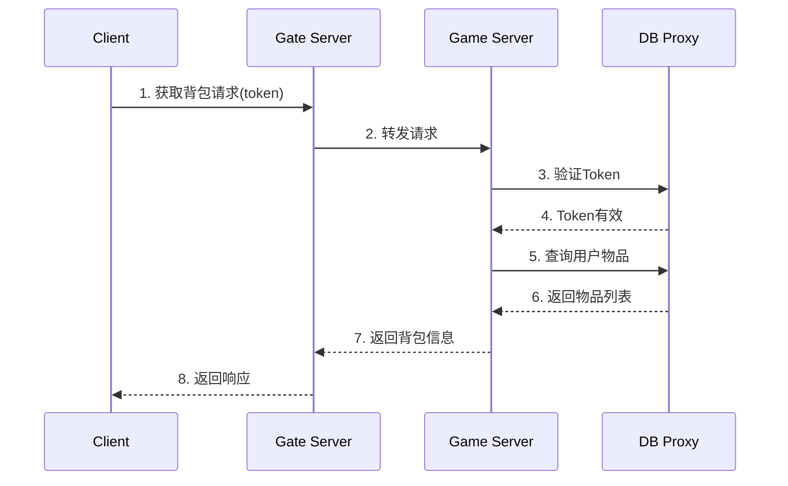

**流程说明:**
1. 客户端发送获取背包请求
2. 网关转发请求到游戏服务器
3. 游戏服务器通过DB代理验证Token
4. Token验证通过
5. 游戏服务器查询用户物品数据
6. DB代理返回物品列表
7. 游戏服务器处理并返回数据
8. 网关将响应发送给客户端

### 5.2 使用物品流程
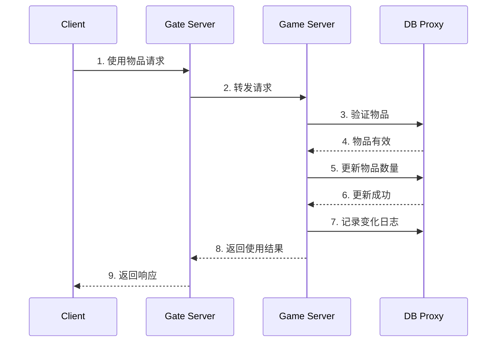

**流程说明:**
1. 客户端发送使用物品请求
2. 网关转发请求到游戏服务器
3. 游戏服务器验证物品是否可用
4. 物品验证通过
5. 更新物品数量
6. 数据库更新成功
7. 记录物品变化日志
8. 游戏服务器返回使用结果
9. 网关将响应发送给客户端

### 5.3 扩展背包流程
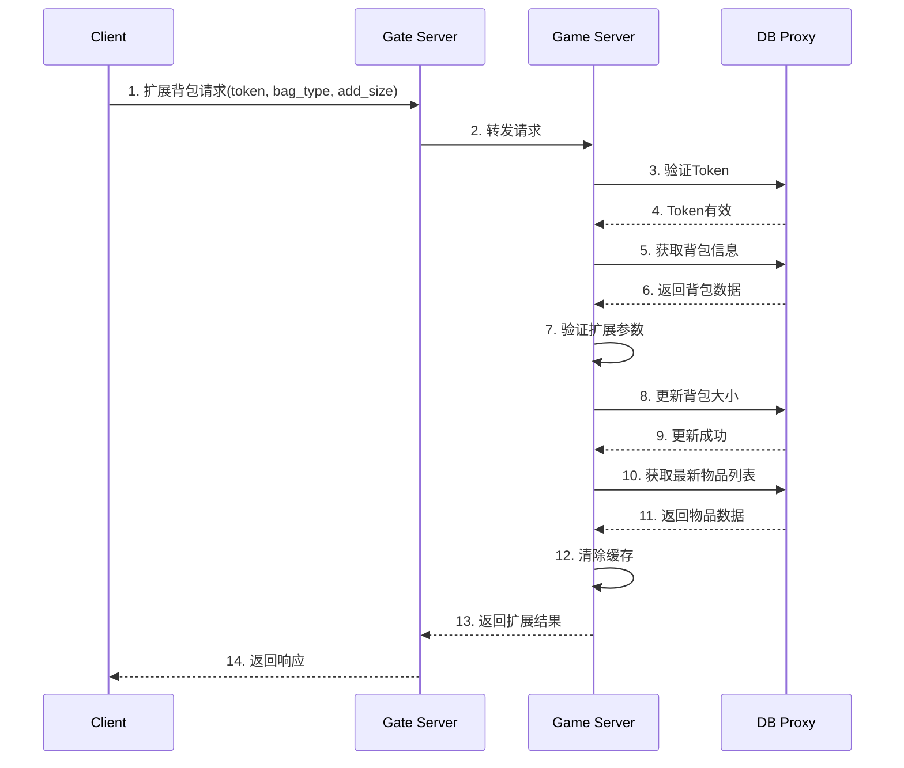

**流程说明:**
1. 客户端发送扩展背包请求，包含令牌、背包类型和扩展大小
2. 网关转发请求到游戏服务器
3. 游戏服务器通过DB代理验证Token
4. Token验证通过
5. 游戏服务器查询当前背包信息
6. DB代理返回背包数据
7. 游戏服务器验证扩展参数（背包类型、扩展大小、最大限制等）
8. 更新背包大小到数据库
9. 数据库更新成功
10. 获取最新的物品列表
11. DB代理返回物品数据
12. 清除相关缓存
13. 游戏服务器返回扩展结果
14. 网关将响应发送给客户端

### 5.4 整理背包流程
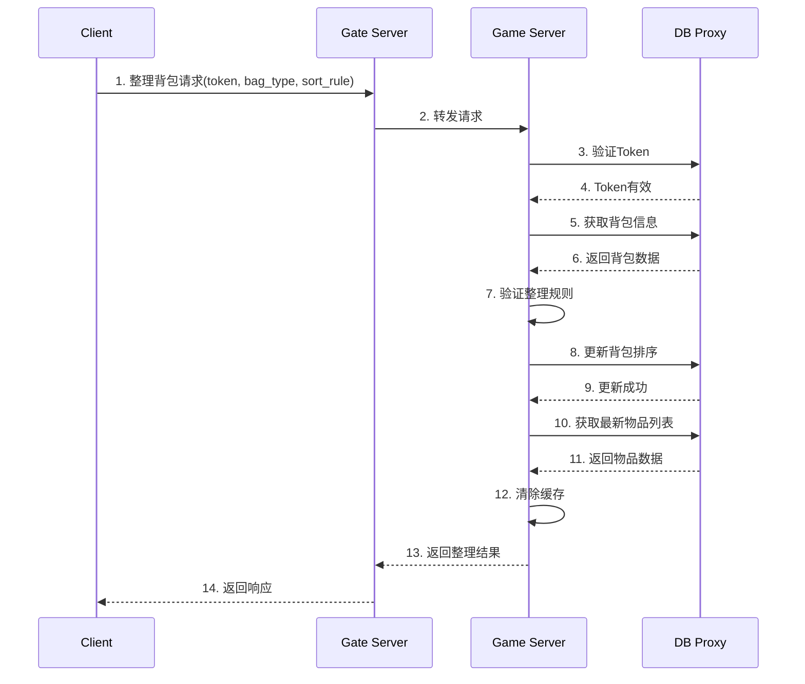

**流程说明:**   
1. 客户端发送整理背包请求，包含令牌、背包类型和整理规则
2. 网关转发请求到游戏服务器
3. 游戏服务器通过DB代理验证Token
4. Token验证通过
5. 游戏服务器查询当前背包信息
6. DB代理返回背包数据   
7. 游戏服务器验证整理规则
8. 更新背包排序到数据库
9. 数据库更新成功
10. 获取最新的物品列表
11. DB代理返回物品数据
12. 清除相关缓存
13. 游戏服务器返回整理结果  
14. 网关将响应发送给客户端

### 5.5 移动物品流程
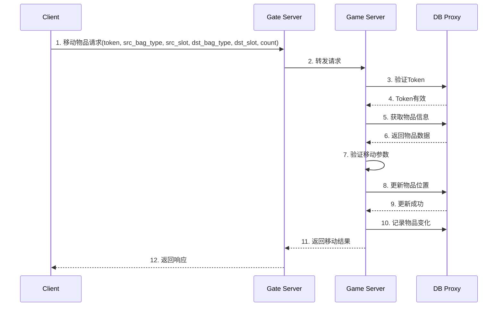

**流程说明:**
1. 客户端发送移动物品请求，包含令牌、源背包类型、源格子位置、目标背包类型、目标格子位置和可选的移动数量
2. 网关转发请求到游戏服务器 
3. 游戏服务器通过DB代理验证Token
4. Token验证通过
5. 游戏服务器查询物品信息
6. DB代理返回物品数据
7. 游戏服务器验证移动参数
8. 更新物品位置到数据库 
9. 数据库更新成功
10. 记录物品变化
11. 游戏服务器返回移动结果
12. 网关将响应发送给客户端

### 5.6 物品合成流程    
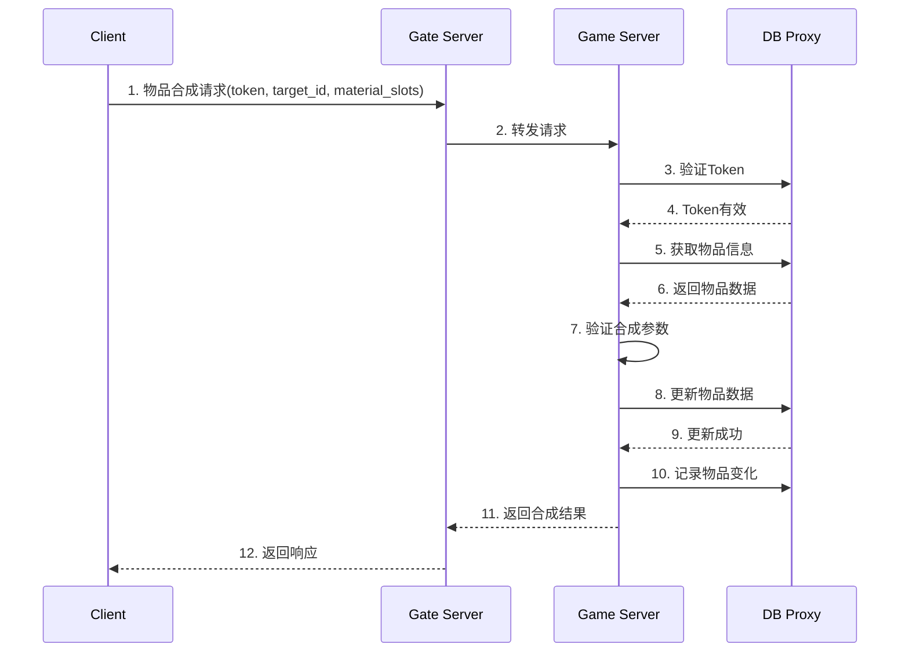

**流程说明:**
1. 客户端发送物品合成请求，包含令牌、目标物品ID和材料格子位置列表
2. 网关转发请求到游戏服务器 
3. 游戏服务器通过DB代理验证Token
4. Token验证通过
5. 游戏服务器查询物品信息
6. DB代理返回物品数据
7. 游戏服务器验证合成参数
8. 更新物品数据到数据库 
9. 数据库更新成功       
10. 记录物品变化
11. 游戏服务器返回合成结果
12. 网关将响应发送给客户端

### 5.7 物品分解流程    
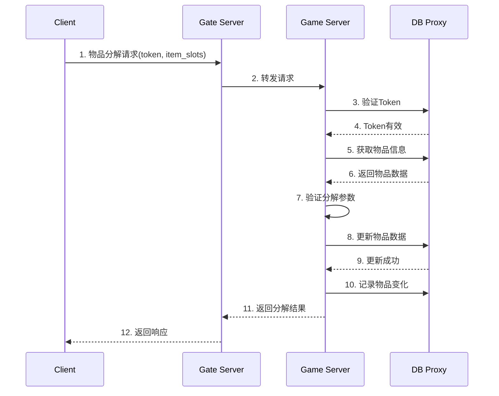

**流程说明:**
1. 客户端发送物品分解请求，包含令牌和物品格子位置列表
2. 网关转发请求到游戏服务器
3. 游戏服务器通过DB代理验证Token
4. Token验证通过
5. 游戏服务器查询物品信息
6. DB代理返回物品数据
7. 游戏服务器验证分解参数
8. 更新物品数据到数据库
9. 数据库更新成功
10. 记录物品变化
11. 游戏服务器返回分解结果
12. 网关将响应发送给客户端  

## 6. GM 指令流程   
### 6.1 GM 指令流程
```mermaid
    participant C as Client
    participant G as Gate Server
    participant GM as Game Server
    participant DB as DB Proxy
    
    C->>G: 1. GM指令请求(token, command, params)
    G->>GM: 2. 转发请求
    GM->>DB: 3. 验证Token和权限
    DB-->>GM: 4. 权限验证通过
    
    alt add_item 命令
        GM->>DB: 5a. 获取背包信息
        DB-->>GM: 6a. 返回背包数据
        GM->>GM: 7a. 验证物品参数
        GM->>DB: 8a. 更新物品数据
        DB-->>GM: 9a. 更新成功
        GM->>DB: 10a. 记录物品变化
    else del_item 命令
        GM->>DB: 5b. 获取物品信息
        DB-->>GM: 6b. 返回物品数据
        GM->>GM: 7b. 验证删除参数
        GM->>DB: 8b. 更新物品数据
        DB-->>GM: 9b. 更新成功
        GM->>DB: 10b. 记录物品变化
    else set_level 命令
        GM->>DB: 5c. 获取用户信息
        DB-->>GM: 6c. 返回用户数据
        GM->>GM: 7c. 验证等级参数
        GM->>DB: 8c. 更新用户等级
        DB-->>GM: 9c. 更新成功
        GM->>DB: 10c. 记录等级变化
    end
    
    GM-->>G: 11. 返回执行结果
    G-->>C: 12. 返回响应
```

**流程说明:**
1. 客户端发送GM指令请求，包含令牌、命令和参数
2. 网关转发请求到游戏服务器
3. 游戏服务器验证Token和GM权限
4. 权限验证通过
5. 根据命令类型执行不同操作：
   - add_item: 添加物品到背包
   - del_item: 从背包删除物品
   - set_level: 设置用户等级
   - clear_bag: 清空背包
6. 获取相关数据
7. 验证操作参数
8. 更新数据到数据库
9. 数据库更新成功
10. 记录操作日志
11. 游戏服务器返回执行结果
12. 网关将响应发送给客户端
