# 流程说明

## 1. 登录流程

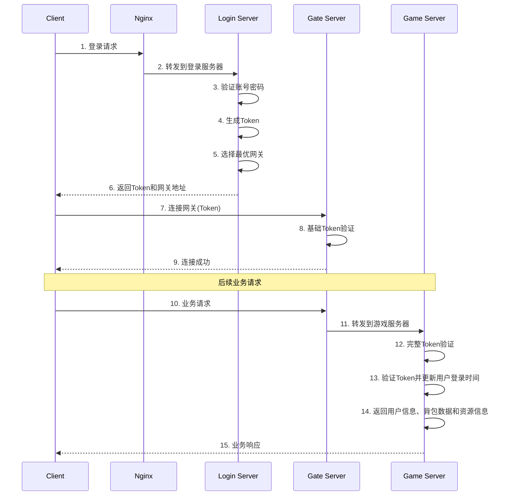
```mermaid
sequenceDiagram
    participant C as Client
    participant N as Nginx
    participant L as Login Server
    participant G as Gate Server
    participant GM as Game Server
    
    C->>N: 1. 登录请求
    N->>L: 2. 转发到登录服务器
    L->>L: 3. 验证账号密码
    L->>L: 4. 生成Token
    L->>L: 5. 选择最优网关
    L-->>C: 6. 返回Token和网关地址
    C->>G: 7. 连接网关(Token)
    G->>G: 8. 基础Token验证
    G-->>C: 9. 连接成功
    
    Note over C,GM: 后续业务请求
    C->>G: 10. 业务请求
    G->>GM: 11. 转发到游戏服务器
    GM->>GM: 12. 完整Token验证
    GM->>GM: 13. 验证Token并更新用户登录时间
    GM->>GM: 14. 返回用户信息、背包数据和资源信息
    GM-->>C: 15. 业务响应
```

**流程说明:**
1. 客户端发送登录请求到Nginx
2. Nginx根据配置转发到登录服务器
3. 登录服务器验证账号密码
4. 验证成功后生成JWT Token
5. 根据负载均衡策略选择合适的网关
6. 返回Token和网关信息给客户端
7. 客户端使用Token连接网关
8. 网关进行基础Token验证(格式、过期时间)
9. 验证通过后建立WebSocket连接
10. 客户端发送业务请求到游戏服务器
11. 游戏服务器验证Token并更新用户登录时间
12. 游戏服务器返回用户信息、背包数据和资源信息
13. 返回业务响应到客户端

注意: 每次用户登录时，系统会自动更新用户的登录时间，这反映在响应的user对象的login_time字段中。

## 2. 心跳机制

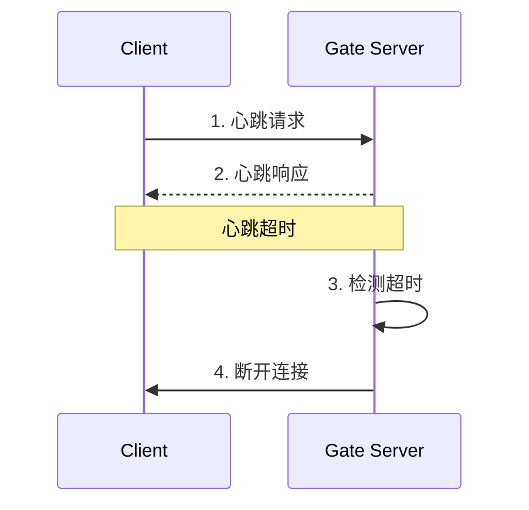
```mermaid
sequenceDiagram
    participant C as Client
    participant G as Gate Server
    
    C->>G: 1. 心跳请求
    G-->>C: 2. 心跳响应
    
    Note over C,G: 心跳超时
    G->>G: 3. 检测超时
    G->>C: 4. 断开连接
```

**流程说明:**
1. 客户端定期发送心跳请求
2. 网关返回心跳响应
3. 网关检测心跳超时
4. 超时后断开连接

## 3. 获取用户信息流程

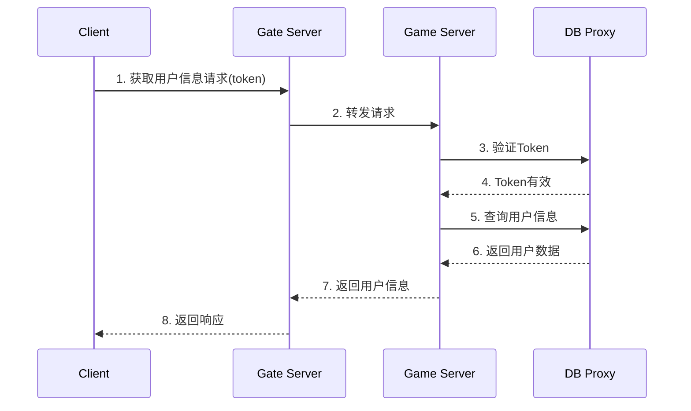
```mermaid
sequenceDiagram
    participant C as Client
    participant G as Gate Server
    participant GM as Game Server
    participant DB as DB Proxy
    
    C->>G: 1. 获取用户信息请求(token)
    G->>GM: 2. 转发请求
    GM->>DB: 3. 验证Token
    DB-->>GM: 4. Token有效
    GM->>DB: 5. 查询用户信息
    DB-->>GM: 6. 返回用户数据
    GM-->>G: 7. 返回用户信息
    G-->>C: 8. 返回响应
```

**流程说明:**
1. 客户端发送获取用户信息请求
2. 网关转发请求到游戏服务器
3. 游戏服务器通过DB代理验证Token
4. Token验证通过
5. 游戏服务器查询用户数据
6. DB代理返回用户信息
7. 游戏服务器处理并返回数据
8. 网关将响应发送给客户端

## 4. 获取用户卡牌流程

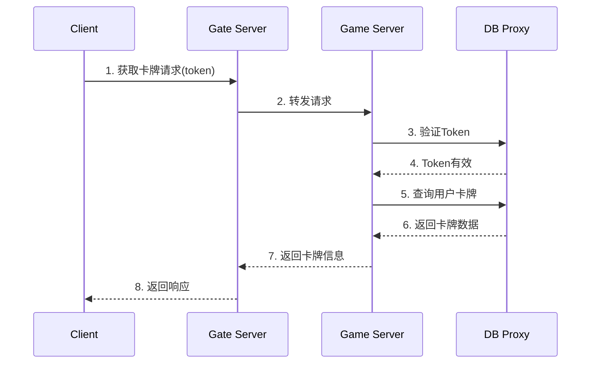
```mermaid
sequenceDiagram
    participant C as Client
    participant G as Gate Server
    participant GM as Game Server
    participant DB as DB Proxy
    
    C->>G: 1. 获取卡牌请求(token)
    G->>GM: 2. 转发请求
    GM->>DB: 3. 验证Token
    DB-->>GM: 4. Token有效
    GM->>DB: 5. 查询用户卡牌
    DB-->>GM: 6. 返回卡牌数据
    GM-->>G: 7. 返回卡牌信息
    G-->>C: 8. 返回响应
```

**流程说明:**
1. 客户端发送获取卡牌请求
2. 网关转发请求到游戏服务器
3. 游戏服务器通过DB代理验证Token
4. Token验证通过
5. 游戏服务器查询用户卡牌数据
6. DB代理返回卡牌信息
7. 游戏服务器处理并返回数据
8. 网关将响应发送给客户端

## 5. 物品系统流程

### 5.1 获取背包流程
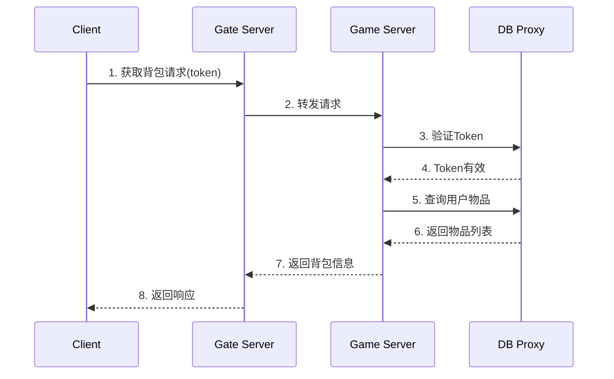
```mermaid
sequenceDiagram
    participant C as Client
    participant G as Gate Server
    participant GM as Game Server
    participant DB as DB Proxy
    
    C->>G: 1. 获取背包请求(token)
    G->>GM: 2. 转发请求
    GM->>DB: 3. 验证Token
    DB-->>GM: 4. Token有效
    GM->>DB: 5. 查询用户物品
    DB-->>GM: 6. 返回物品列表
    GM-->>G: 7. 返回背包信息
    G-->>C: 8. 返回响应
```

**流程说明:**
1. 客户端发送获取背包请求
2. 网关转发请求到游戏服务器
3. 游戏服务器通过DB代理验证Token
4. Token验证通过
5. 游戏服务器查询用户物品数据
6. DB代理返回物品列表
7. 游戏服务器处理并返回数据
8. 网关将响应发送给客户端

### 5.2 使用物品流程
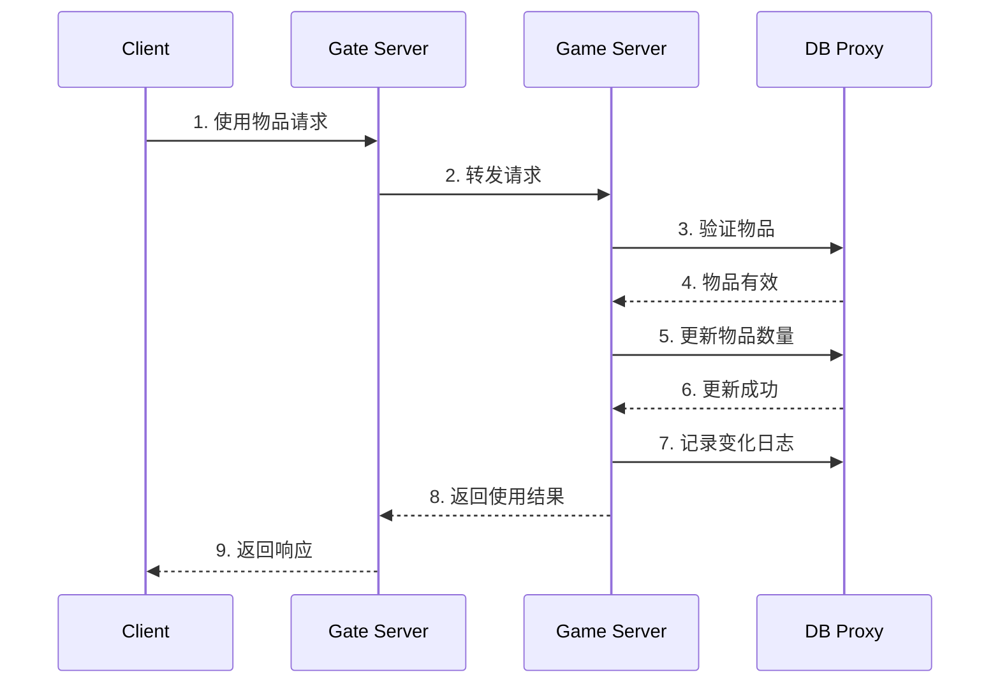
```mermaid
sequenceDiagram
    participant C as Client
    participant G as Gate Server
    participant GM as Game Server
    participant DB as DB Proxy
    
    C->>G: 1. 使用物品请求
    G->>GM: 2. 转发请求
    GM->>DB: 3. 验证物品
    DB-->>GM: 4. 物品有效
    GM->>DB: 5. 更新物品数量
    DB-->>GM: 6. 更新成功
    GM->>DB: 7. 记录变化日志
    GM-->>G: 8. 返回使用结果
    G-->>C: 9. 返回响应
```

**流程说明:**
1. 客户端发送使用物品请求
2. 网关转发请求到游戏服务器
3. 游戏服务器验证物品是否可用
4. 物品验证通过
5. 更新物品数量
6. 数据库更新成功
7. 记录物品变化日志
8. 游戏服务器返回使用结果
9. 网关将响应发送给客户端

### 5.3 扩展背包流程
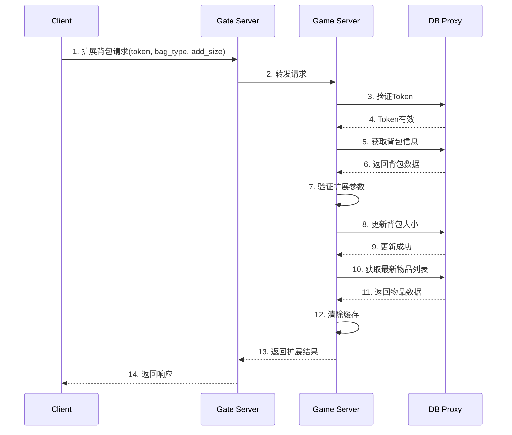
```mermaid
sequenceDiagram
    participant C as Client
    participant G as Gate Server
    participant GM as Game Server
    participant DB as DB Proxy
    
    C->>G: 1. 扩展背包请求(token, bag_type, add_size)
    G->>GM: 2. 转发请求
    GM->>DB: 3. 验证Token
    DB-->>GM: 4. Token有效
    GM->>DB: 5. 获取背包信息
    DB-->>GM: 6. 返回背包数据
    GM->>GM: 7. 验证扩展参数
    GM->>DB: 8. 更新背包大小
    DB-->>GM: 9. 更新成功
    GM->>DB: 10. 获取最新物品列表
    DB-->>GM: 11. 返回物品数据
    GM->>GM: 12. 清除缓存
    GM-->>G: 13. 返回扩展结果
    G-->>C: 14. 返回响应
```

**流程说明:**
1. 客户端发送扩展背包请求，包含令牌、背包类型和扩展大小
2. 网关转发请求到游戏服务器
3. 游戏服务器通过DB代理验证Token
4. Token验证通过
5. 游戏服务器查询当前背包信息
6. DB代理返回背包数据
7. 游戏服务器验证扩展参数（背包类型、扩展大小、最大限制等）
8. 更新背包大小到数据库
9. 数据库更新成功
10. 获取最新的物品列表
11. DB代理返回物品数据
12. 清除相关缓存
13. 游戏服务器返回扩展结果
14. 网关将响应发送给客户端

### 5.4 整理背包流程
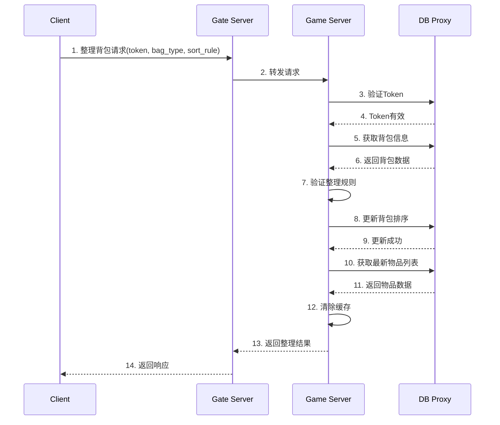
```mermaid
sequenceDiagram
    participant C as Client
    participant G as Gate Server
    participant GM as Game Server
    participant DB as DB Proxy
    
    C->>G: 1. 整理背包请求(token, bag_type, sort_rule)
    G->>GM: 2. 转发请求
    GM->>DB: 3. 验证Token
    DB-->>GM: 4. Token有效
    GM->>DB: 5. 获取背包信息    
    DB-->>GM: 6. 返回背包数据
    GM->>GM: 7. 验证整理规则
    GM->>DB: 8. 更新背包排序
    DB-->>GM: 9. 更新成功
    GM->>DB: 10. 获取最新物品列表
    DB-->>GM: 11. 返回物品数据  
    GM->>GM: 12. 清除缓存
    GM-->>G: 13. 返回整理结果
    G-->>C: 14. 返回响应
```

**流程说明:**   
1. 客户端发送整理背包请求，包含令牌、背包类型和整理规则
2. 网关转发请求到游戏服务器
3. 游戏服务器通过DB代理验证Token
4. Token验证通过
5. 游戏服务器查询当前背包信息
6. DB代理返回背包数据   
7. 游戏服务器验证整理规则
8. 更新背包排序到数据库
9. 数据库更新成功
10. 获取最新的物品列表
11. DB代理返回物品数据
12. 清除相关缓存
13. 游戏服务器返回整理结果  
14. 网关将响应发送给客户端

### 5.5 移动物品流程
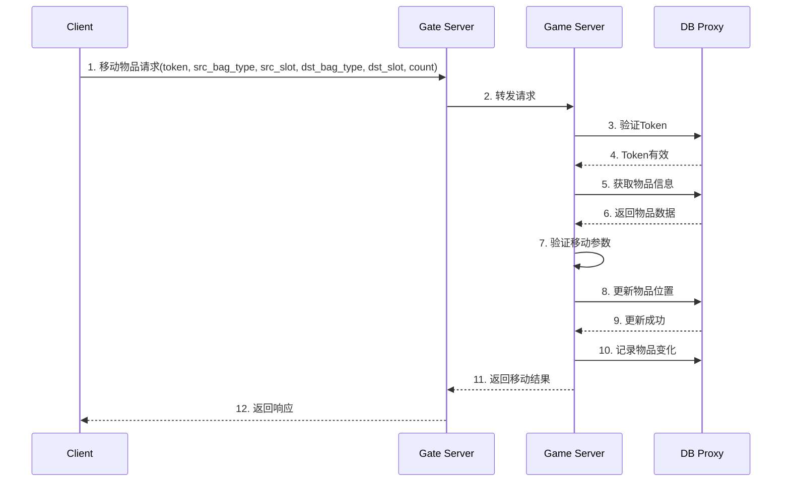
```mermaid
sequenceDiagram
    participant C as Client
    participant G as Gate Server
    participant GM as Game Server
    participant DB as DB Proxy
    
    C->>G: 1. 移动物品请求(token, src_bag_type, src_slot, dst_bag_type, dst_slot, count)
    G->>GM: 2. 转发请求
    GM->>DB: 3. 验证Token
    DB-->>GM: 4. Token有效
    GM->>DB: 5. 获取物品信息
    DB-->>GM: 6. 返回物品数据
    GM->>GM: 7. 验证移动参数
    GM->>DB: 8. 更新物品位置
    DB-->>GM: 9. 更新成功
    GM->>DB: 10. 记录物品变化
    GM-->>G: 11. 返回移动结果
    G-->>C: 12. 返回响应
```

**流程说明:**
1. 客户端发送移动物品请求，包含令牌、源背包类型、源格子位置、目标背包类型、目标格子位置和可选的移动数量
2. 网关转发请求到游戏服务器 
3. 游戏服务器通过DB代理验证Token
4. Token验证通过
5. 游戏服务器查询物品信息
6. DB代理返回物品数据
7. 游戏服务器验证移动参数
8. 更新物品位置到数据库 
9. 数据库更新成功
10. 记录物品变化
11. 游戏服务器返回移动结果
12. 网关将响应发送给客户端

### 5.6 物品合成流程    
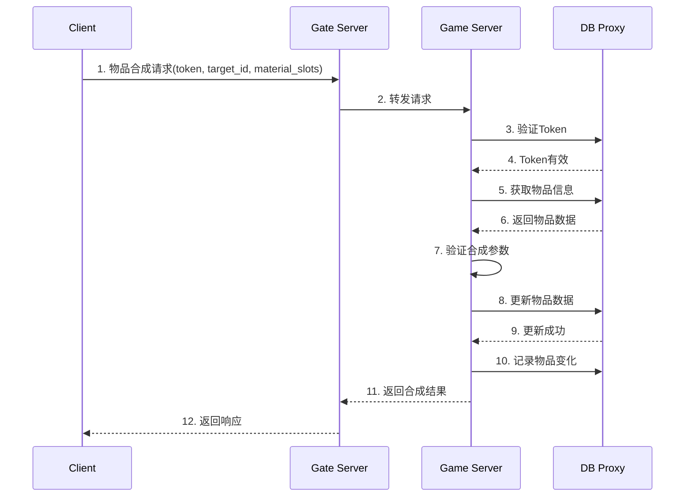
```mermaid
sequenceDiagram
    participant C as Client
    participant G as Gate Server
    participant GM as Game Server   
    participant DB as DB Proxy
    
    C->>G: 1. 物品合成请求(token, target_id, material_slots)
    G->>GM: 2. 转发请求
    GM->>DB: 3. 验证Token
    DB-->>GM: 4. Token有效  
    GM->>DB: 5. 获取物品信息
    DB-->>GM: 6. 返回物品数据
    GM->>GM: 7. 验证合成参数
    GM->>DB: 8. 更新物品数据
    DB-->>GM: 9. 更新成功
    GM->>DB: 10. 记录物品变化   
    GM-->>G: 11. 返回合成结果
    G-->>C: 12. 返回响应
```

**流程说明:**
1. 客户端发送物品合成请求，包含令牌、目标物品ID和材料格子位置列表
2. 网关转发请求到游戏服务器 
3. 游戏服务器通过DB代理验证Token
4. Token验证通过
5. 游戏服务器查询物品信息
6. DB代理返回物品数据
7. 游戏服务器验证合成参数
8. 更新物品数据到数据库 
9. 数据库更新成功       
10. 记录物品变化
11. 游戏服务器返回合成结果
12. 网关将响应发送给客户端

### 5.7 物品分解流程    
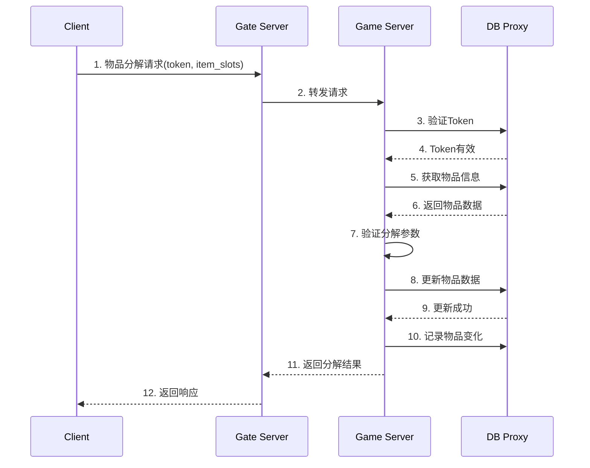
```mermaid
sequenceDiagram
    participant C as Client
    participant G as Gate Server
    participant GM as Game Server
    participant DB as DB Proxy
    
    C->>G: 1. 物品分解请求(token, item_slots)
    G->>GM: 2. 转发请求
    GM->>DB: 3. 验证Token
    DB-->>GM: 4. Token有效
    GM->>DB: 5. 获取物品信息
    DB-->>GM: 6. 返回物品数据
    GM->>GM: 7. 验证分解参数
    GM->>DB: 8. 更新物品数据
    DB-->>GM: 9. 更新成功
    GM->>DB: 10. 记录物品变化
    GM-->>G: 11. 返回分解结果
    G-->>C: 12. 返回响应
```

**流程说明:**
1. 客户端发送物品分解请求，包含令牌和物品格子位置列表
2. 网关转发请求到游戏服务器
3. 游戏服务器通过DB代理验证Token
4. Token验证通过
5. 游戏服务器查询物品信息
6. DB代理返回物品数据
7. 游戏服务器验证分解参数
8. 更新物品数据到数据库
9. 数据库更新成功
10. 记录物品变化
11. 游戏服务器返回分解结果
12. 网关将响应发送给客户端  

## 6. GM 指令流程   
### 6.1 GM 指令流程
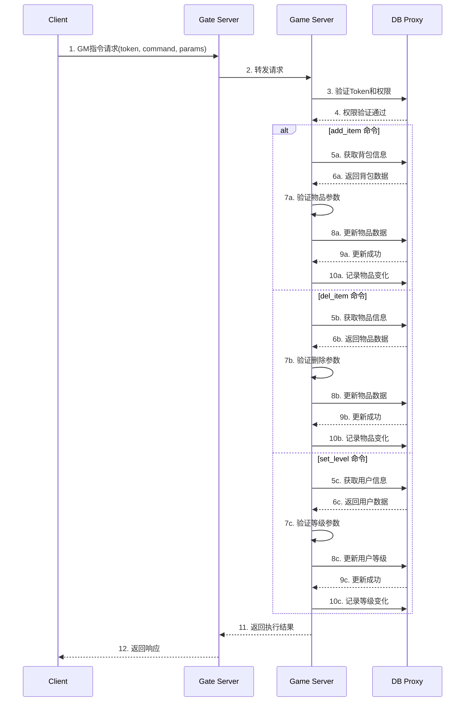
```mermaid
sequenceDiagram
    participant C as Client
    participant G as Gate Server
    participant GM as Game Server
    participant DB as DB Proxy
    
    C->>G: 1. GM指令请求(token, command, params)
    G->>GM: 2. 转发请求
    GM->>DB: 3. 验证Token和权限
    DB-->>GM: 4. 权限验证通过
    
    alt add_item 命令
        GM->>DB: 5a. 获取背包信息
        DB-->>GM: 6a. 返回背包数据
        GM->>GM: 7a. 验证物品参数
        GM->>DB: 8a. 更新物品数据
        DB-->>GM: 9a. 更新成功
        GM->>DB: 10a. 记录物品变化
    else del_item 命令
        GM->>DB: 5b. 获取物品信息
        DB-->>GM: 6b. 返回物品数据
        GM->>GM: 7b. 验证删除参数
        GM->>DB: 8b. 更新物品数据
        DB-->>GM: 9b. 更新成功
        GM->>DB: 10b. 记录物品变化
    else set_level 命令
        GM->>DB: 5c. 获取用户信息
        DB-->>GM: 6c. 返回用户数据
        GM->>GM: 7c. 验证等级参数
        GM->>DB: 8c. 更新用户等级
        DB-->>GM: 9c. 更新成功
        GM->>DB: 10c. 记录等级变化
    end
    
    GM-->>G: 11. 返回执行结果
    G-->>C: 12. 返回响应
```

**流程说明:**
1. 客户端发送GM指令请求，包含令牌、命令和参数
2. 网关转发请求到游戏服务器
3. 游戏服务器验证Token和GM权限
4. 权限验证通过
5. 根据命令类型执行不同操作：
   - add_item: 添加物品到背包
   - del_item: 从背包删除物品
   - set_level: 设置用户等级
   - clear_bag: 清空背包
6. 获取相关数据
7. 验证操作参数
8. 更新数据到数据库
9. 数据库更新成功
10. 记录操作日志
11. 游戏服务器返回执行结果
12. 网关将响应发送给客户端

## 7. 邮件系统流程

### 7.1 获取邮件列表流程

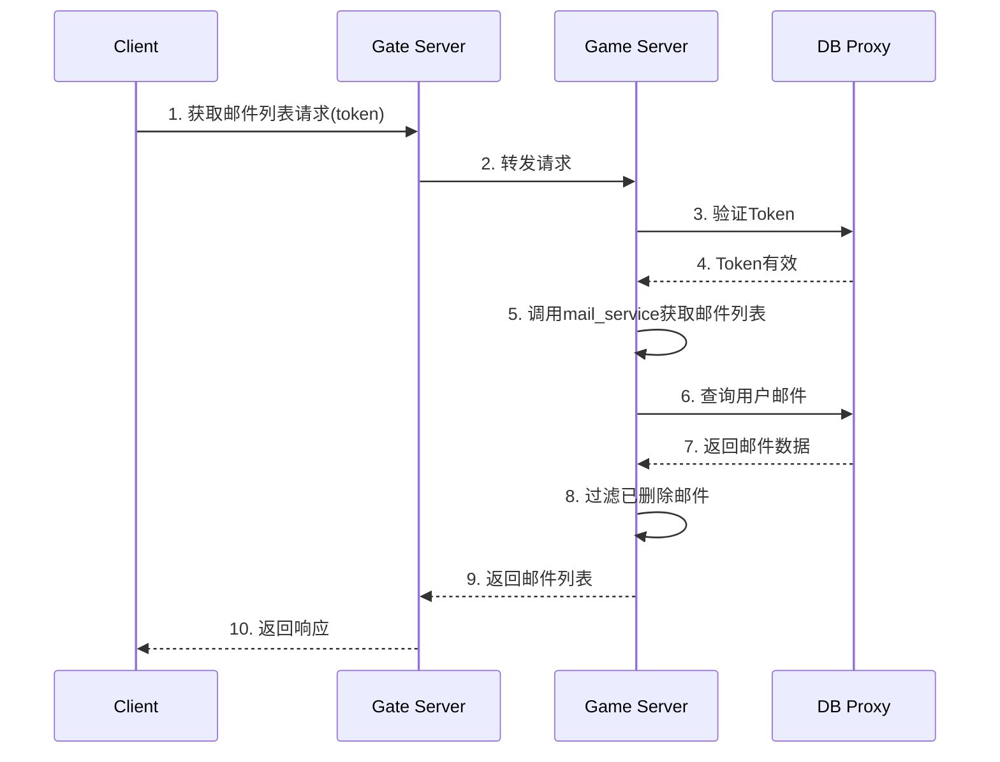
```mermaid
sequenceDiagram
    participant C as Client
    participant G as Gate Server
    participant GM as Game Server
    participant DB as DB Proxy
    
    C->>G: 1. 获取邮件列表请求(token)
    G->>GM: 2. 转发请求
    GM->>DB: 3. 验证Token
    DB-->>GM: 4. Token有效
    GM->>GM: 5. 调用mail_service获取邮件列表
    GM->>DB: 6. 查询用户邮件
    DB-->>GM: 7. 返回邮件数据
    GM->>GM: 8. 过滤已删除邮件
    GM-->>G: 9. 返回邮件列表
    G-->>C: 10. 返回响应
```

**流程说明:**
1. 客户端发送获取邮件列表请求
2. 网关转发请求到游戏服务器
3. 游戏服务器通过DB代理验证Token
4. Token验证通过
5. 游戏服务器调用mail_service获取邮件列表
6. 查询用户邮件数据（优先从缓存获取）
7. DB代理返回邮件数据
8. 过滤掉已标记为删除状态的邮件
9. 游戏服务器处理并返回数据
10. 网关将响应发送给客户端

### 7.2 读取邮件流程

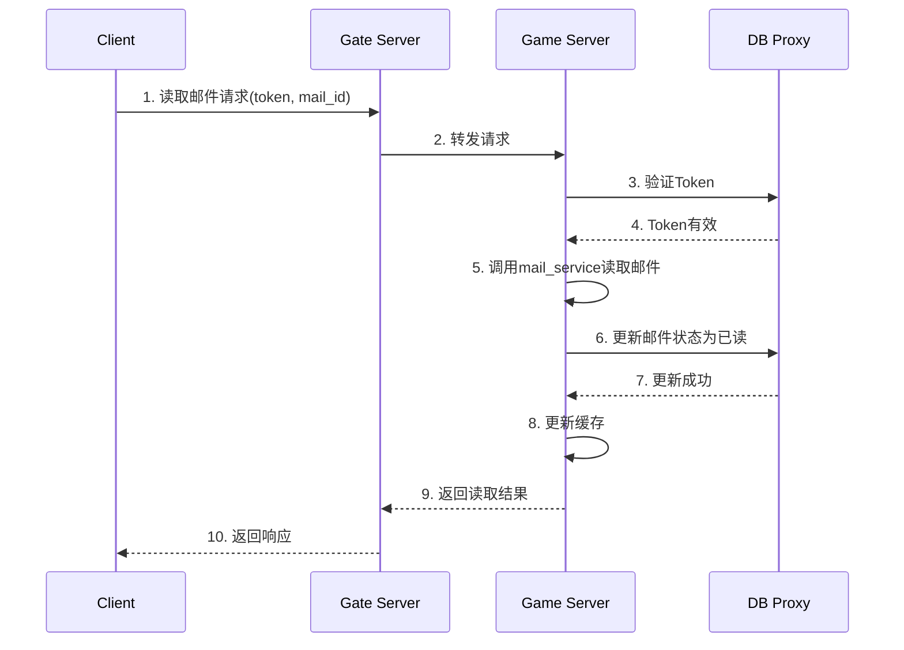
```mermaid
sequenceDiagram
    participant C as Client
    participant G as Gate Server
    participant GM as Game Server
    participant DB as DB Proxy
    
    C->>G: 1. 读取邮件请求(token, mail_id)
    G->>GM: 2. 转发请求
    GM->>DB: 3. 验证Token
    DB-->>GM: 4. Token有效
    GM->>GM: 5. 调用mail_service读取邮件
    GM->>DB: 6. 更新邮件状态为已读
    DB-->>GM: 7. 更新成功
    GM->>GM: 8. 更新缓存
    GM-->>G: 9. 返回读取结果
    G-->>C: 10. 返回响应
```

**流程说明:**
1. 客户端发送读取邮件请求，包含邮件ID
2. 网关转发请求到游戏服务器
3. 游戏服务器通过DB代理验证Token
4. Token验证通过
5. 游戏服务器调用mail_service读取邮件
6. 更新邮件状态为已读(2)
7. 数据库更新成功
8. 更新邮件缓存
9. 游戏服务器返回读取结果
10. 网关将响应发送给客户端

### 7.3 领取邮件附件流程

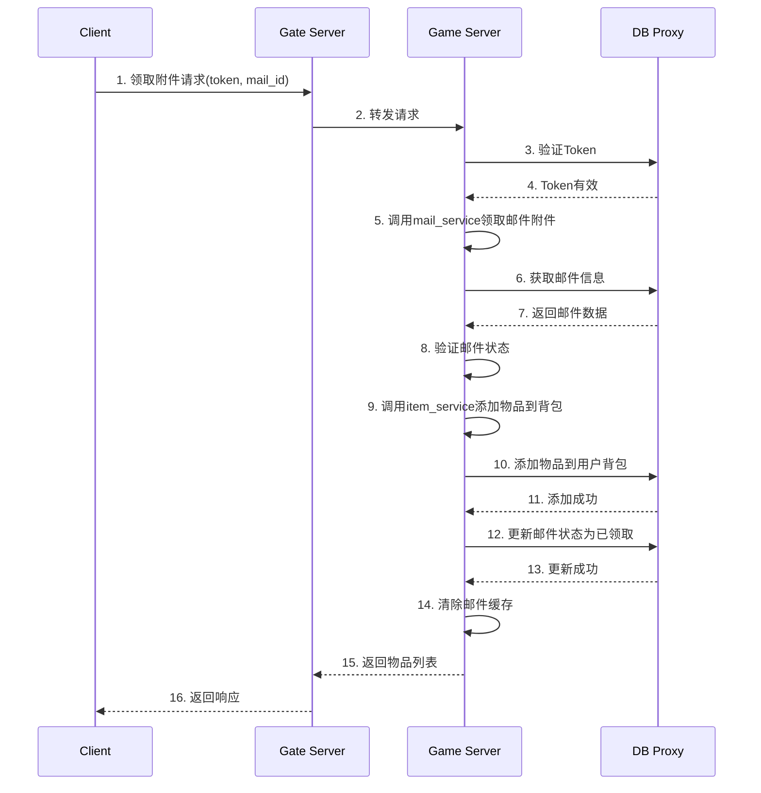
```mermaid
sequenceDiagram
    participant C as Client
    participant G as Gate Server
    participant GM as Game Server
    participant DB as DB Proxy
    
    C->>G: 1. 领取附件请求(token, mail_id)
    G->>GM: 2. 转发请求
    GM->>DB: 3. 验证Token
    DB-->>GM: 4. Token有效
    GM->>GM: 5. 调用mail_service领取邮件附件
    GM->>DB: 6. 获取邮件信息
    DB-->>GM: 7. 返回邮件数据
    GM->>GM: 8. 验证邮件状态
    GM->>GM: 9. 调用item_service添加物品到背包
    GM->>DB: 10. 添加物品到用户背包
    DB-->>GM: 11. 添加成功
    GM->>DB: 12. 更新邮件状态为已领取
    DB-->>GM: 13. 更新成功
    GM->>GM: 14. 清除邮件缓存
    GM-->>G: 15. 返回物品列表
    G-->>C: 16. 返回响应
```

**流程说明:**
1. 客户端发送领取邮件附件请求，包含邮件ID
2. 网关转发请求到游戏服务器
3. 游戏服务器通过DB代理验证Token
4. Token验证通过
5. 游戏服务器调用mail_service领取邮件附件
6. 查询邮件信息
7. DB代理返回邮件数据
8. 验证邮件状态（确保附件未被领取）
9. 调用item_service添加物品到用户背包
10. 更新背包数据
11. 物品添加成功
12. 更新邮件状态为已领取(3)
13. 邮件状态更新成功
14. 清除邮件缓存以确保状态一致性
15. 游戏服务器返回领取的物品列表
16. 网关将响应发送给客户端

### 7.4 删除邮件流程

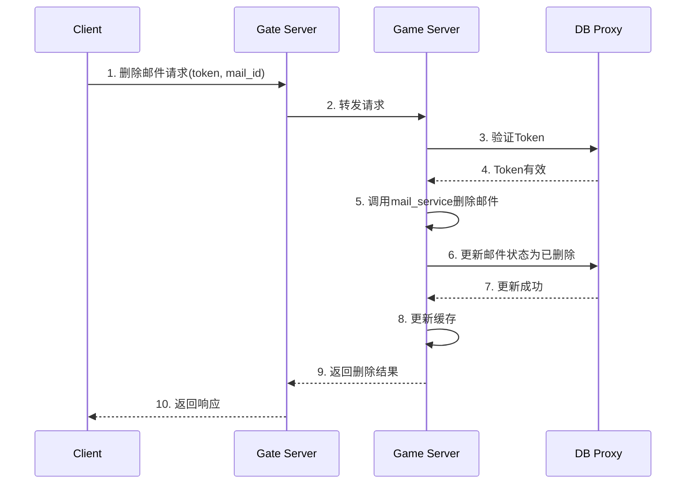
```mermaid
sequenceDiagram
    participant C as Client
    participant G as Gate Server
    participant GM as Game Server
    participant DB as DB Proxy
    
    C->>G: 1. 删除邮件请求(token, mail_id)
    G->>GM: 2. 转发请求
    GM->>DB: 3. 验证Token
    DB-->>GM: 4. Token有效
    GM->>GM: 5. 调用mail_service删除邮件
    GM->>DB: 6. 更新邮件状态为已删除
    DB-->>GM: 7. 更新成功
    GM->>GM: 8. 更新缓存
    GM-->>G: 9. 返回删除结果
    G-->>C: 10. 返回响应
```

**流程说明:**
1. 客户端发送删除邮件请求，包含邮件ID
2. 网关转发请求到游戏服务器
3. 游戏服务器通过DB代理验证Token
4. Token验证通过
5. 游戏服务器调用mail_service删除邮件
6. 更新邮件状态为已删除(4)，不实际删除数据
7. 数据库更新成功
8. 更新邮件缓存
9. 游戏服务器返回删除结果
10. 网关将响应发送给客户端

### 7.5 系统邮件发送流程

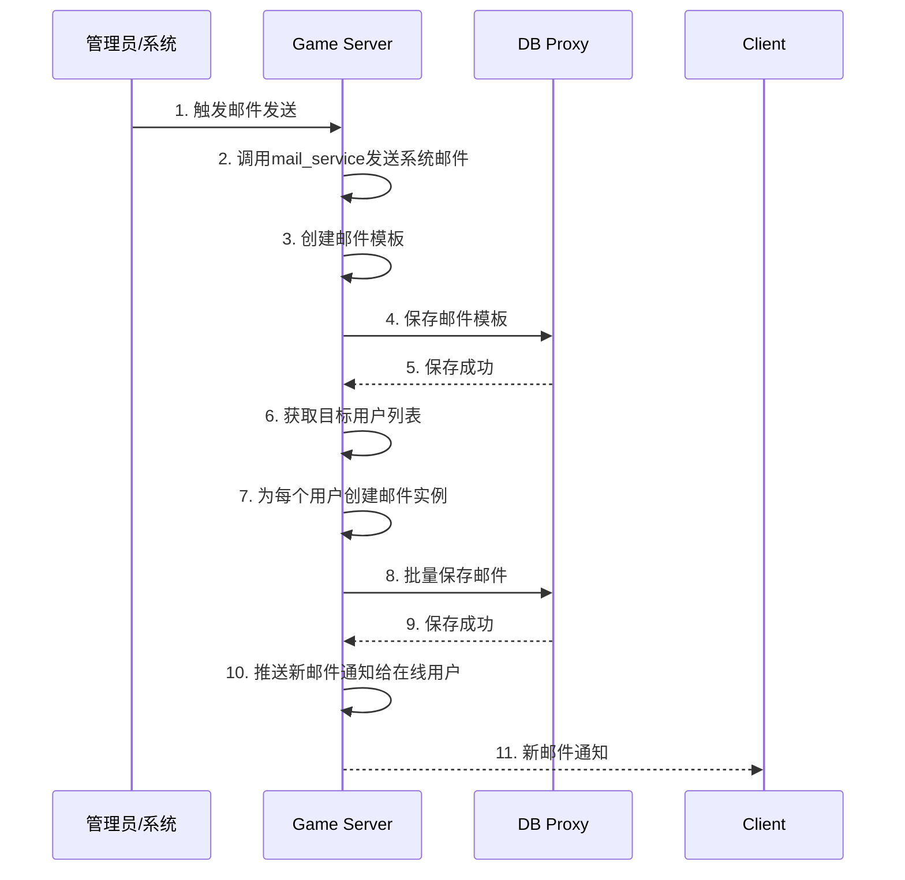
```mermaid
sequenceDiagram
    participant Admin as 管理员/系统
    participant GM as Game Server
    participant DB as DB Proxy
    participant C as Client
    
    Admin->>GM: 1. 触发邮件发送
    GM->>GM: 2. 调用mail_service发送系统邮件
    GM->>GM: 3. 创建邮件模板
    GM->>DB: 4. 保存邮件模板
    DB-->>GM: 5. 保存成功
    GM->>GM: 6. 获取目标用户列表
    GM->>GM: 7. 为每个用户创建邮件实例
    GM->>DB: 8. 批量保存邮件
    DB-->>GM: 9. 保存成功
    GM->>GM: 10. 推送新邮件通知给在线用户
    GM-->>C: 11. 新邮件通知
```

**流程说明:**
1. 管理员或系统触发邮件发送（活动开始、奖励发放等）
2. 游戏服务器调用mail_service发送系统邮件
3. 创建邮件模板（标题、内容、附件等）
4. 保存邮件模板到数据库
5. 模板保存成功
6. 获取目标用户列表（全服或特定用户群）
7. 为每个目标用户创建邮件实例
8. 批量保存邮件数据到数据库
9. 邮件保存成功
10. 向在线用户推送新邮件通知
11. 客户端收到新邮件通知

## 8. 伙伴系统流程

### 8.1 获取伙伴列表流程
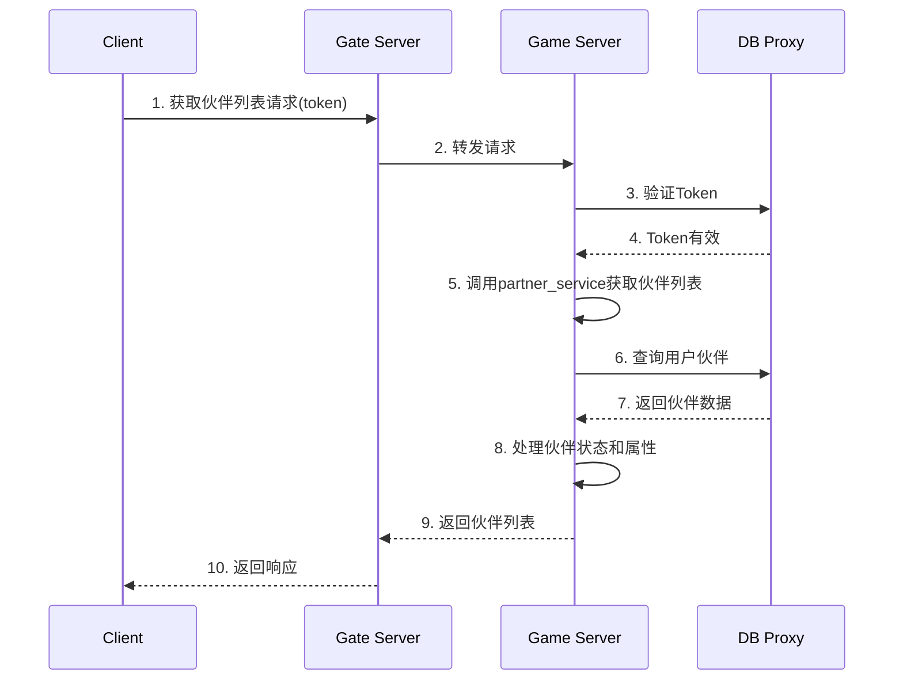
```mermaid
sequenceDiagram
    participant C as Client
    participant G as Gate Server
    participant GM as Game Server
    participant DB as DB Proxy
    
    C->>G: 1. 获取伙伴列表请求(token)
    G->>GM: 2. 转发请求
    GM->>DB: 3. 验证Token
    DB-->>GM: 4. Token有效
    GM->>GM: 5. 调用partner_service获取伙伴列表
    GM->>DB: 6. 查询用户伙伴
    DB-->>GM: 7. 返回伙伴数据
    GM->>GM: 8. 处理伙伴状态和属性
    GM-->>G: 9. 返回伙伴列表
    G-->>C: 10. 返回响应
```

**流程说明:**
1. 客户端发送获取伙伴列表请求
2. 网关转发请求到游戏服务器
3. 游戏服务器通过DB代理验证Token
4. Token验证通过
5. 游戏服务器调用partner_service获取伙伴列表
6. 查询用户伙伴数据（优先从缓存获取）
7. DB代理返回伙伴数据
8. 处理伙伴状态（已解锁/可解锁/未解锁）和属性
9. 游戏服务器处理并返回数据
10. 网关将响应发送给客户端

### 8.2 伙伴升级流程
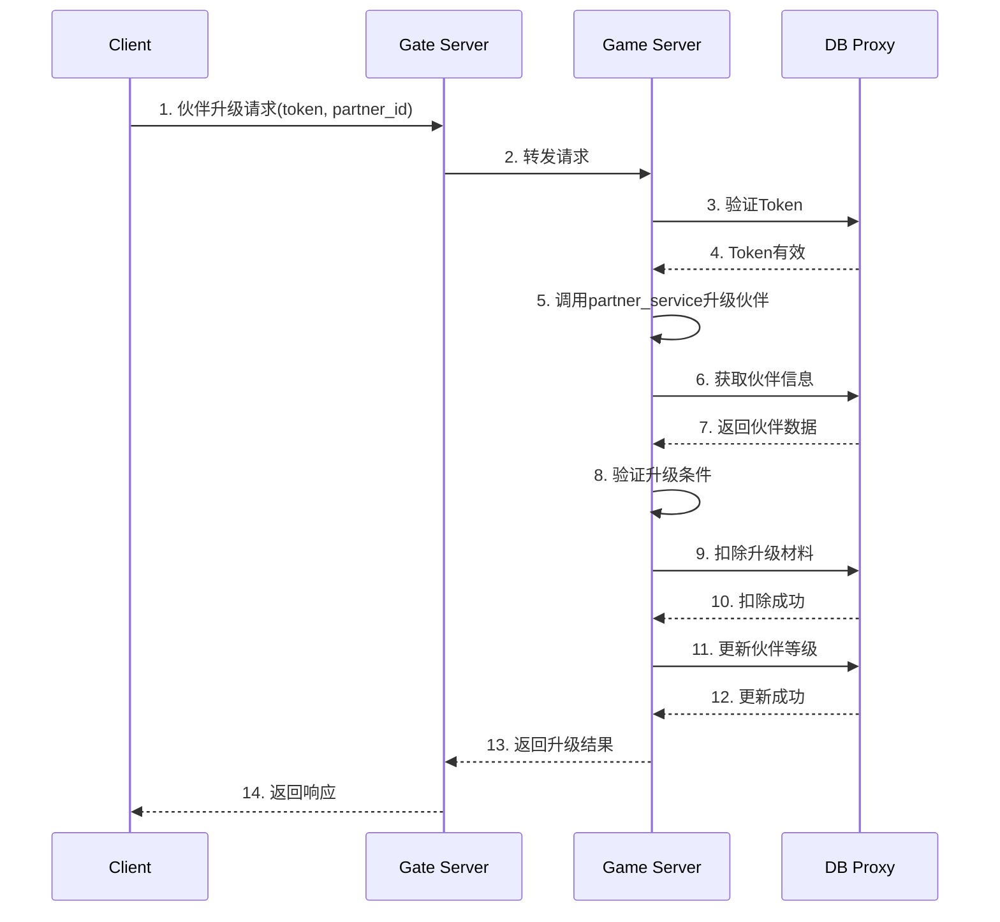
```mermaid
sequenceDiagram
    participant C as Client
    participant G as Gate Server
    participant GM as Game Server
    participant DB as DB Proxy
    
    C->>G: 1. 伙伴升级请求(token, partner_id)
    G->>GM: 2. 转发请求
    GM->>DB: 3. 验证Token
    DB-->>GM: 4. Token有效
    GM->>GM: 5. 调用partner_service升级伙伴
    GM->>DB: 6. 获取伙伴信息
    DB-->>GM: 7. 返回伙伴数据
    GM->>GM: 8. 验证升级条件
    GM->>DB: 9. 扣除升级材料
    DB-->>GM: 10. 扣除成功
    GM->>DB: 11. 更新伙伴等级
    DB-->>GM: 12. 更新成功
    GM-->>G: 13. 返回升级结果
    G-->>C: 14. 返回响应
```

**流程说明:**
1. 客户端发送伙伴升级请求，包含伙伴ID
2. 网关转发请求到游戏服务器
3. 游戏服务器通过DB代理验证Token
4. Token验证通过
5. 游戏服务器调用partner_service升级伙伴
6. 查询伙伴信息
7. DB代理返回伙伴数据
8. 验证升级条件（等级上限、材料是否足够）
9. 扣除升级所需材料
10. 材料扣除成功
11. 更新伙伴等级
12. 数据库更新成功
13. 游戏服务器返回升级结果
14. 网关将响应发送给客户端

### 8.3 伙伴升星流程

```mermaid
sequenceDiagram
    participant C as Client
    participant G as Gate Server
    participant GM as Game Server
    participant DB as DB Proxy
    
    C->>G: 1. 伙伴升星请求(token, partner_id)
    G->>GM: 2. 转发请求
    GM->>DB: 3. 验证Token
    DB-->>GM: 4. Token有效
    GM->>GM: 5. 调用partner_service升星伙伴
    GM->>DB: 6. 获取伙伴信息
    DB-->>GM: 7. 返回伙伴数据
    GM->>GM: 8. 验证升星条件
    GM->>DB: 9. 扣除升星材料
    DB-->>GM: 10. 扣除成功
    GM->>DB: 11. 更新伙伴星级
    DB-->>GM: 12. 更新成功
    GM-->>G: 13. 返回升星结果
    G-->>C: 14. 返回响应
```

**流程说明:**
1. 客户端发送伙伴升星请求，包含伙伴ID
2. 网关转发请求到游戏服务器
3. 游戏服务器通过DB代理验证Token
4. Token验证通过
5. 游戏服务器调用partner_service升星伙伴
6. 查询伙伴信息
7. DB代理返回伙伴数据
8. 验证升星条件（星级上限、材料是否足够）
9. 扣除升星所需材料
10. 材料扣除成功
11. 更新伙伴星级
12. 数据库更新成功
13. 游戏服务器返回升星结果
14. 网关将响应发送给客户端

### 8.4 伙伴解锁流程
```mermaid
sequenceDiagram
    participant C as Client
    participant G as Gate Server
    participant GM as Game Server
    participant DB as DB Proxy
    
    C->>G: 1. 伙伴解锁请求(token, unit_id)
    G->>GM: 2. 转发请求
    GM->>DB: 3. 验证Token
    DB-->>GM: 4. Token有效
    GM->>GM: 5. 调用partner_service解锁伙伴
    GM->>DB: 6. 获取伙伴碎片信息
    DB-->>GM: 7. 返回碎片数据
    GM->>GM: 8. 验证解锁条件
    GM->>DB: 9. 扣除伙伴碎片
    DB-->>GM: 10. 扣除成功
    GM->>DB: 11. 创建新伙伴
    DB-->>GM: 12. 创建成功
    GM-->>G: 13. 返回解锁结果
    G-->>C: 14. 返回响应
```

**流程说明:**
1. 客户端发送伙伴解锁请求，包含单位ID
2. 网关转发请求到游戏服务器
3. 游戏服务器通过DB代理验证Token
4. Token验证通过
5. 游戏服务器调用partner_service解锁伙伴
6. 查询用户伙伴碎片信息
7. DB代理返回碎片数据
8. 验证解锁条件（碎片是否足够）
9. 扣除解锁所需碎片
10. 碎片扣除成功
11. 创建新的伙伴实例
12. 数据库创建成功
13. 游戏服务器返回解锁结果
14. 网关将响应发送给客户端
